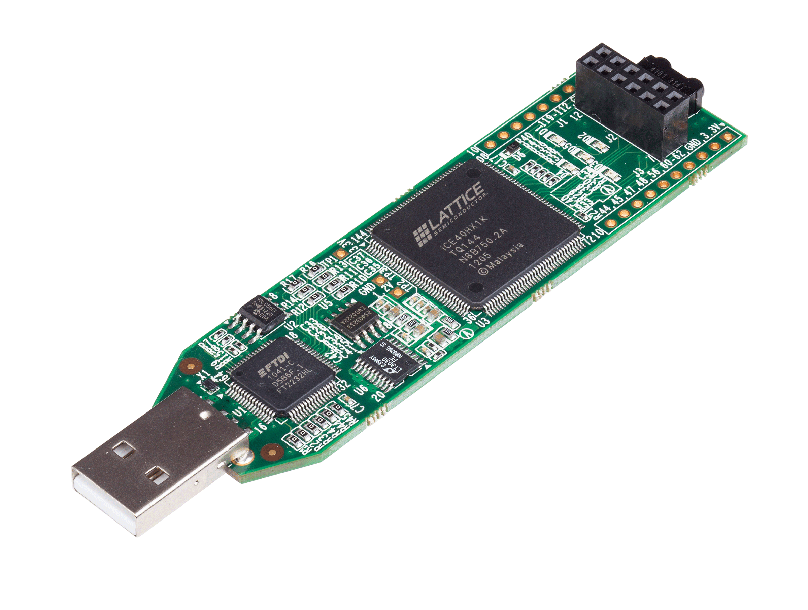

# Getting Started with iCEstick

Start by going to [iCEstick Evaluation kit](https://www.latticesemi.com/icestick).

This is a "USB thumb drive form factor evaluation board - The iCEstick Evaluation Kit is an easy to use, small size board that allows rapid prototyping of system functions at a very low cost using Lattice Semiconductor's [iCE40 FPGA](https://www.latticesemi.com/Products/FPGAandCPLD/iCE40) family."

# Approaches
## Open Source
There is a vibrant open source community with many tools and examples, combined with documentation.

[Open Source Approach](approach-opensource.md)

## Commercial
Lattice has several tools to support their FPGAs. However, there are several limits to the OS and some of them can be costly.

[Lattice Approach](approach-lattice.md)

# Disclaimer
Be kind :)

It's been a long time since I've worked with an FPGA. This repo is the beginning of getting back into them.
